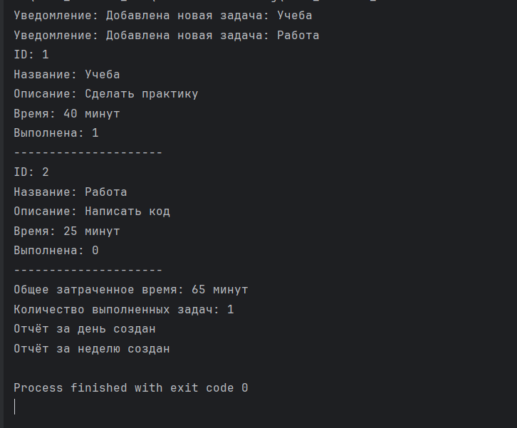

# Тайм-трекер


### Проект представляет собой простую версию тайм-трекера.  
Приложение позволяет создавать задачи, хранить их в списке, отмечать задачи как выполненные, учитывать затраченное время и формировать простые отчёты.

В проекте также показано применение паттернов проектирования:

- Singleton
- Factory Method
- Observer
- Strategy
- Facade


## Использованные паттерны
### Singleton

Используется в классе TaskManager. Он нужен, чтобы в программе был только один общий список задач.

### Factory Method

Используется в классе ReportFactory. Он нужен для создания разных типов отчётов: дневного и недельного.

### Observer

Используется в классах Observer и ConsoleNotifier. Он нужен, чтобы уведомлять систему о добавлении новой задачи.

### Strategy

Используется в классах StatisticsStrategy, TotalTimeStrategy и CompletedTasksStrategy. Он нужен для разных способов подсчёта статистики.

### Facade

Используется в классе AppFacade. Он нужен, чтобы упростить работу с основными функциями приложения.

## Инструкция по сборке
Для сборки проекта используется CMake.

Сначала нужно открыть терминал в папке проекта.

Затем выполнить команды:
``` 
cmake -S . -B build 
```
```
cmake --build build
```

## Пример запуска

После сборки нужно перейти в папку build:
```
cd build
```
Запустить программу:
```
./Time_Tracker_PKS
```
### Вывод программы:


## Сторонние библиотеки

Сторонние библиотеки в проекте не используются.

Проект использует только стандартную библиотеку C++:
```
<iostream>
<string>
<vector>
<memory>
```
### Требования
CMake 3.31 или новее
Компилятор C++ с поддержкой стандарта C++20


